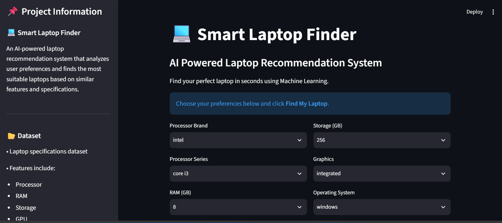
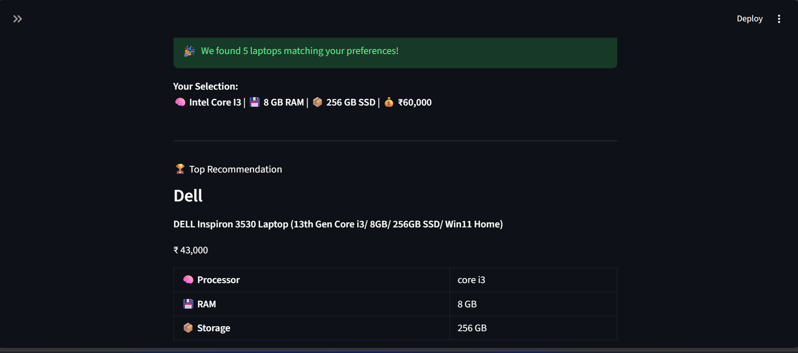
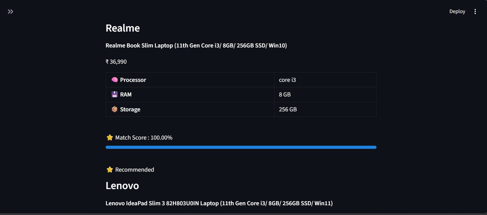

# 💻 Smart Laptop Finder

A Machine Learning-based Laptop Recommendation System that helps users discover the best laptops by analyzing their preferences and matching them with laptops having similar features and specifications.

---

## 🌐 Live Demo

https://laptop-recommendation-system-fslcahswf4fkrfmxhka4fx.streamlit.app/

---

## 📌 Project Overview

Choosing the right laptop can be confusing because of the large number of available options. This project simplifies the process by recommending laptops based on the user's preferred processor, RAM, storage, graphics type, operating system, and budget.

The recommendation engine uses Machine Learning techniques to identify laptops with similar specifications and presents the best matches through an interactive Streamlit web application.

---

## ✨ Features

- 💻 User-friendly Streamlit interface
- 🧠 Preference-based laptop recommendations
- 💰 Budget filtering
- ⭐ Similarity score for every recommendation
- 📊 Sort by:
  - Best Match
  - Lowest Price
  - Highest Price
- ⚡ Fast recommendation using Cosine Similarity

---

## 🛠️ Tech Stack

- Python
- Pandas
- NumPy
- Scikit-learn
- Streamlit
- Scipy

---

## 🤖 Machine Learning Approach

The recommendation engine uses Content-Based Filtering by converting laptop specifications into numerical feature vectors. Categorical features are encoded using One-Hot Encoding, numerical features are scaled using StandardScaler, and Cosine Similarity is used to recommend laptops with the most similar specifications.

### Data Preprocessing

- One-Hot Encoding for categorical features
- Feature Scaling using StandardScaler
- Feature matrix creation using SciPy

### Similarity Measurement

Cosine Similarity is used to compare laptop specifications and identify the most similar laptops based on user preferences.

---

## 📂 Input Features

The recommendation system considers:

- Processor Brand
- Processor Series
- RAM
- Storage Capacity
- Graphics Type
- Operating System

---

## 🎯 Output

The system recommends laptops with:

- Brand
- Model
- Price
- Processor
- RAM
- Storage
- Match Score

---

## 🚀 How It Works

1. User selects laptop preferences.
2. Features are preprocessed using Machine Learning techniques.
3. Cosine Similarity calculates similarity scores.
4. Matching laptops are filtered according to the selected budget.
5. Results are sorted based on the selected option.
6. The top recommendations are displayed.

---

## 📁 Project Structure

```
Laptop-Recommendation-System/
│
├── Screenshot/
├── app.py
├── recommendation.py
├── ml_recommendation.py
├── laptops.csv
├── requirements.txt
├── README.md
└── .gitignore
```

---

## 📷 Application Preview

### 🏠 Home Screen



### 💻 Recommendation Results



### ⭐ More Recommendations


---

## ▶️ Installation

Clone the repository

```bash
git clone https://github.com/SuhaniDhanotiya/Laptop-Recommendation-System.git
```

Move to the project directory

```bash
cd Laptop-Recommendation-System
```

Install dependencies

```bash
pip install -r requirements.txt
```

Run the application

```bash
python -m streamlit run app.py
```

---

## 📌 Future Improvements

- Brand filtering
- Display size preference
- Battery backup filtering
- Laptop image support
- Direct purchase links
- Advanced recommendation algorithm

---

## 👩‍💻 Developer

**Suhani Dhanotiya**

Aspiring Machine Learning Engineer
